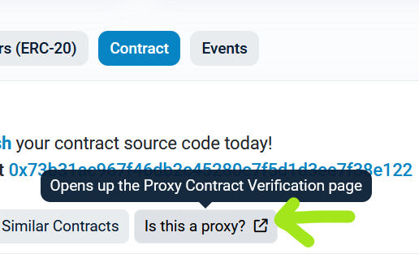
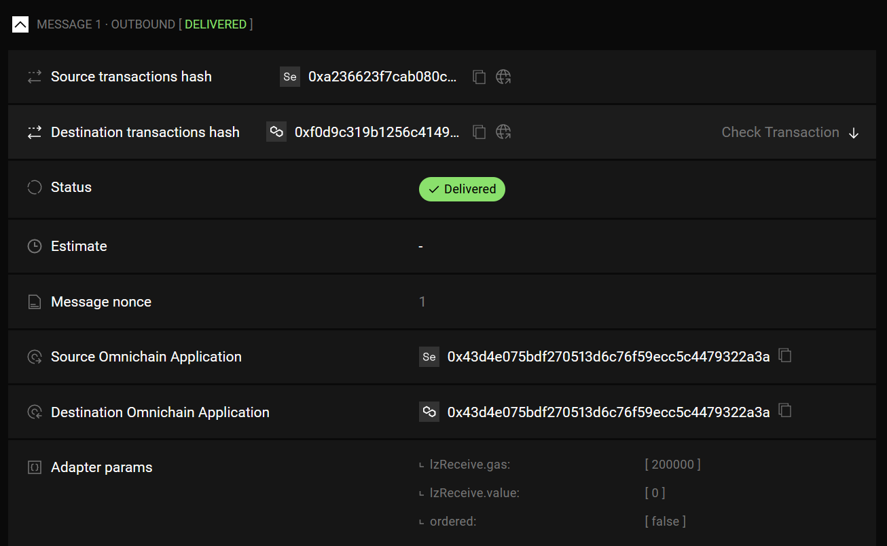

## Upgradeable LayerZero V2 Foundry Starter Pack

This repository can be cloned to quickly start building upgradeable applications on top of LayerZero V2. It includes libraries required for development, contains test setup and working multichain deployment script written in Solidity.

These are the potential advantages of using this repository instead of official [LZ V2](https://github.com/LayerZero-Labs/LayerZero-v2) repository:
1. Multichain deployment script written in Solidity
2. OpenZeppelin V4 upgradeability for applications configured out of the box
3. Native Foundry config - no NPM dependencies ([vide LZ-V2/Issue-#6](https://github.com/LayerZero-Labs/LayerZero-v2/issues/6)), no TypeScript
4. CREATE2 by default for deterministic addresses in multichain deployment
5. Very simple Counter example just to get started without advanced functionality

I still recommend to consult [official repository of LayerZero](https://github.com/LayerZero-Labs/LayerZero-v2) whenever you need to bring more advanced functionality such as composability, nested calls etc. Examples of such aren't part of this repository as of now.

## Usage

### Preparation

```
cp .env.example .env
```

Fill `TEST_DEPLOYER_KEY` and `TEST_OWNER_ADDRESS` before running deployment script.

### Build

```shell
$ forge build
```

### Test

```shell
$ forge test
```

Note: if you want to execute single test file you can add a flag, eg.: `--match-path ./test/CounterUpgradeability.t.sol`.

### Deploy

Dry run:

```shell
forge script DeployCounter -s "deployCounterTestnet(uint256, uint256)" 1 1 --force --multi
```

Note: `1 1` parameters are respectively: `uint256 _counterSalt, uint256 _counterProxySalt`. It affects generated addresses. If you have problem with deployment script failing try changing `1 1` to some random numbers instead. You can't deploy with the same salt twice - it fails with message: `script failed: <no data>`.

Deploy:
```shell
forge script DeployCounter -s "deployCounterTestnet(uint256, uint256)" 1 1 --force --multi --broadcast
```

Note: Don't use automatic `--verify` flag because it doesn't seem to work. Looks like Foundry error.

### Upgrade

Please set `TEST_COUNTER_PROXY_ADDRESS` in `.env` to make sure correct proxy is updated.

```
forge script UpgradeCounter -s "upgradeTestnet()" --force --multi
```

Add `--broadcast` when you're ready to send actual transactions ([example tx](https://sepolia.etherscan.io/tx/0xea00205afe187a984676c68e50d59b5493be72cd1204a7e424ffccdc7c80e1fa)).

### Manual verify

**Counter**

Verifying Counter seems to be more or less automatic.

Verifying Counter (you can obtain `COUNTER_ADDRESS`` from deployment logs, it is "Counter address"):
```
forge verify-contract COUNTER_ADDRESS Counter --watch --chain sepolia
```

On Mumbai it requires more effort to verify the contract. Run:
```
forge verify-contract COUNTER_ADDRESS Counter --chain mumbai --show-standard-json-input > etherscan.json
```

Sometimes even manually uploading the file doesn't seem to work for Mumbai network.

And then manually upload that JSON file as Standard Input into Mumbai Polygonscan. Automatic verification is broken, error:
```
Encountered an error verifying this contract:
Response: `NOTOK`
Details: `Invalid API Key`
```

**Proxy**

Verifying UUPSProxy seems to require marking the contract as proxy in Etherscan interface by clicking "Is this proxy?"



Full verification can be done by manually obtaining constructor args and executing following command:
```
forge verify-contract PROXY_ADDRESS UUPSProxy \
    --constructor-args "0x000000000000000000000000a13e2fa62b771887f383f4a95c4d8e9ea1a0d74800000000000000000000000000000000000000000000000000000000000000400000000000000000000000000000000000000000000000000000000000000044485cc955000000000000000000000000464570ada09869d8741132183721b4f0769a028700000000000000000000000073b31ac967f46db2c45280c7f5d1d3ee7f38e12200000000000000000000000000000000000000000000000000000000" \
    --watch --chain sepolia
```

Constructor arguments can be obtained from `./broadcast/multi/Counter.s.sol-latest/deployCounterTestnet.json` after running deployment script.

### Existing deployment

For demo purposes here are example contracts deployed on Sepolia and Mumbai.

1. Sepolia Proxy: https://sepolia.etherscan.io/address/0x43d4e075bdF270513d6c76F59eCC5C4479322A3a#readProxyContract
2. Mumbai Proxy: https://mumbai.polygonscan.com/address/0x43d4e075bdF270513d6c76F59eCC5C4479322A3a

Both proxies and implementations are verified on [Sourcify](https://sourcify.dev/#/lookup/0x43d4e075bdF270513d6c76F59eCC5C4479322A3a).

```
== Logs ==
Counter address: 0xA13e2fa62b771887F383F4a95c4D8E9eA1A0d748 
Counter Proxy address: 0x43d4e075bdF270513d6c76F59eCC5C4479322A3a 
```

Example cross-chain transaction from Sepolia to Mumbai: [LayerZero Scan](https://testnet.layerzeroscan.com/tx/0xa236623f7cab080c706edf3889fe8dd2c55f0750fc5dc29cb4794dffc361b0e7)

Example message options that can be used for quoting and then calling `increment()`: `0x00030100110100000000000000000000000000030d40` (pay 200k gas to Executor and trigger LZ Receive).



## Inspiration

LayerZero libraries and examples are based on: https://github.com/LayerZero-Labs/LayerZero-v2.

Multichain script deployment setup is heavily based on: https://github.com/timurguvenkaya/foundry-multichain.

## License

[MIT](./LICENSE.md)
